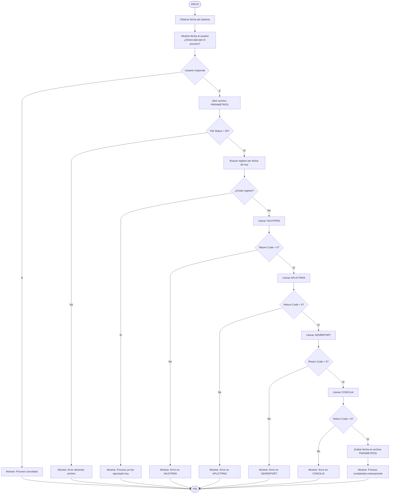

# Cargue-de-datos
Este proyecto se enfoca en el diseño y creación de diferentes programas batch que formaran parte de un aplicativo con el fin
de cargar datos masivos diarios

## Programa: Parametros.cbl
### Objetivo.
Crear parametros con el fin de controlar el cargue diarios en diferentes proyectos

